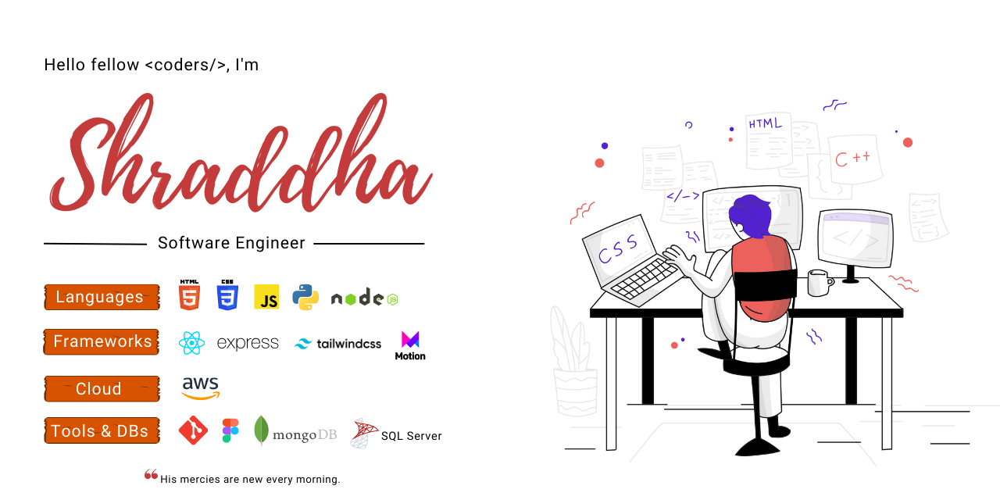

## About Me
💻 I'm a Software Engineer based out of VA, USA.  

☕️ Currently, I am working on:  
✔️ **WTWR - What To Wear**. 
- A full stack application which gets the daily weather forecast, process it, and then based on the forecast, it recommends suitable clothing to the user. 
- GitHub Repository - [click here](https://github.com/practicum-student/wtwr-app) 
  
✔️ **National Youth Bike Council**. 
- A multi view *React* web app with *Strapi* as CMS, for *National Youth Bike Council* whose aim is to to provide an active learning space for young cyclists to boost youth voice in the bicycle industry through peer leadership.  
- Website deployed by Client - [click here](https://www.nybcouncil.com/)  
- GitHub Repository - [click here](https://github.com/5hraddha/national-youth-bike-council) 

🌱 Recent Projects that I have worked on:  
✔️ **Awesome Container Company**  
- A landing page made with React, Tailwind CSS & Framer Motion for *Awesome Container Company*, whose mission is to eliminate plastic and single use packaging in the food and beverage industry.
- Website deployed by Client: [click here](https://awesomecontainer.com/)   
- Demo Webpage - [click here](https://5hraddha.github.io/awesome-container-company/)
- GitHub Repository - [click here](https://github.com/5hraddha/awesome-container-company) 

✔️ **100daysoflovechallenge**  
- *100daysoflovechallenge* is a web service that encourages users to spread love by action & to spread positive vibes by publicly sharing the tasks. Coded as part of 3 days hackathon.   
- Live Webpage - [click here](https://100daysoflove.netlify.app/)
- GitHub Repository - [click here](https://github.com/5hraddha/100daysoflovechallenge)  

✔️ **Around the U.S. Social Network**  
- *Around the U.S.* is a full stack project that features a responsive social network website where a user can have a collection of the pictures of his journey around the US. The webpage interacts with the API endpoints using REST API calls hosted on a backend server.   
- Live Webpage - [click here](https://5hraddha.github.io/around-the-us-vanilla-js/index.html)
- GitHub Repository - [click here](https://github.com/5hraddha/around-the-us-vanilla-js)

🔍 Looking to collaborate on open source/commercial/personal projects.  
📮 Please, contact me at my [email](mailto:mailmeatshraddha@gmail.com) for any opportunities.  

## Let's Connect

